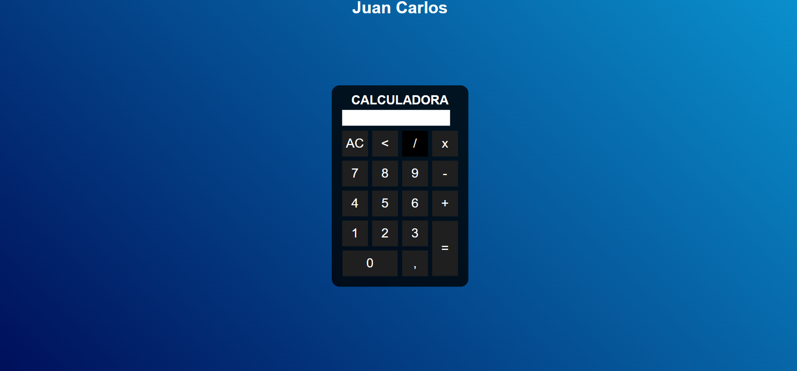

# Calculadora Simples

> Modelo de calculadora

<h2>Como funciona uma calculadora simples?</h2>

A configuração básica do dispositivo é simples. 10 botões para os números, 4 botões para as operações e 1 botão para exibir o resultado do cálculo. É só apertar a sequência de teclas desejada e pronto, o resultado sai certinho.

## 🤝 Colaboradores

Agradecemos às seguintes pessoas que contribuíram para este projeto:

<table>
  <tr>
    <td align="center">
      <a href="#">
         
        
          <b>Juan Carlos</b>
        
      </a>
    </td>
  </tr>
</table>
Link do site: https://juancarllos13.github.io/Calculator/

[⬆ Voltar ao topo](#Yoga) 
